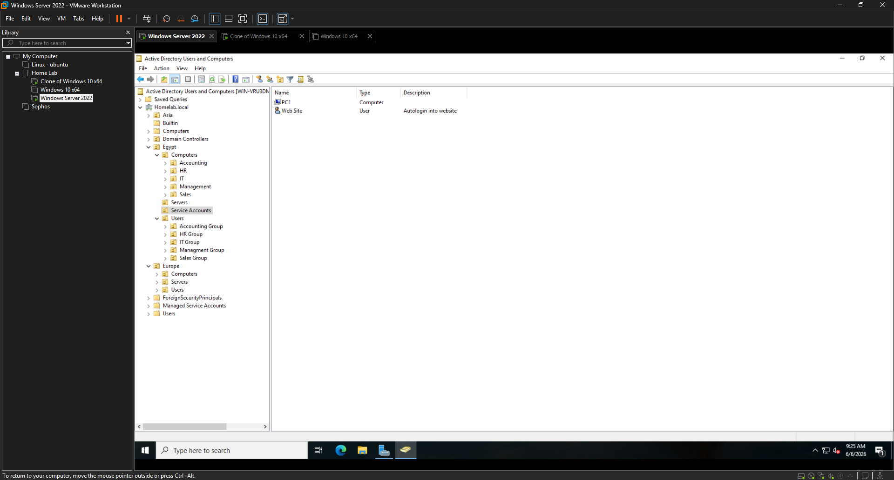
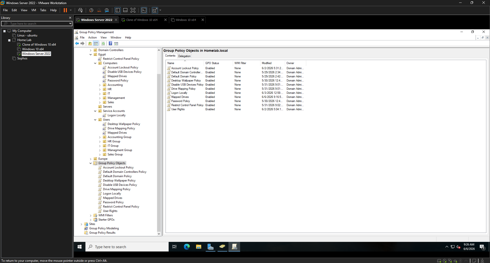
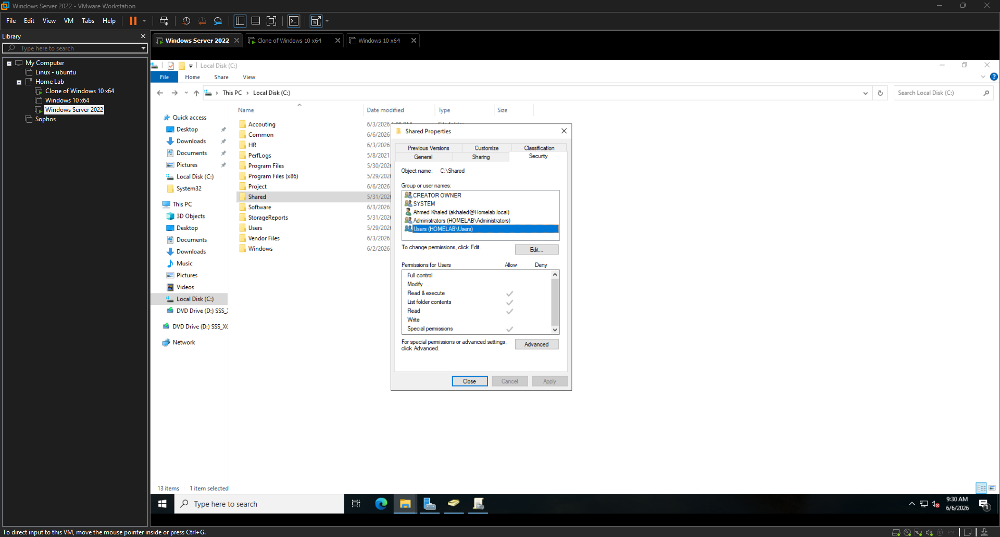

# Enterprise Active Directory Home Lab

## Overview

Designed and deployed a Windows Server 2022 Active Directory environment in VMware Workstation to simulate a real-world enterprise infrastructure.

The lab includes Organizational Units, users, groups, Group Policy Objects, file sharing permissions, and access control implementation based on the principle of least privilege.

---

## Technologies Used

- Windows Server 2022
- Active Directory Domain Services (AD DS)
- Group Policy Management
- VMware Workstation
- DNS
- NTFS Permissions
- Shared Folder Permissions
- Windows 10 Clients

---

## Lab Architecture

### Organizational Units

Egypt
├── Computers
│ ├── Accounting
│ ├── HR
│ ├── IT
│ ├── Management
│ └── Sales
│
├── Users
│ ├── Accounting Group
│ ├── HR Group
│ ├── IT Group
│ ├── Management Group
│ └── Sales Group
│
├── Servers
└── Service Accounts

Europe
├── Computers
├── Users
└── Servers

---

## Features Implemented

### Active Directory

- Created custom Organizational Units
- Created domain users and groups
- Implemented role-based access control
- Organized resources by department and region

### Group Policy Objects

Implemented multiple GPOs including:

- Password Policy
- Account Lockout Policy
- Disable USB Devices Policy
- Desktop Wallpaper Policy
- Drive Mapping Policy
- Logon Locally Restrictions
- Restrict Control Panel Policy
- User Rights Assignment

### File Server Permissions

Configured:

- Shared Folders
- NTFS Permissions
- Security Groups
- Department-based access control

Implemented Least Privilege access model.

---

## Screenshots

### Active Directory Structure

### Group Policy Management

### Shared Folder Permissions

---

## Skills Demonstrated

- Windows Server Administration
- Active Directory Management
- Group Policy Administration
- Identity and Access Management (IAM)
- File Server Management
- Network Administration
- Virtualization
- Security Hardening
- Troubleshooting

---

## Future Improvements

- DFS Namespace
- WSUS Deployment
- DHCP Server
- Sophos Firewall Integration
- Azure AD Connect
- Hybrid Identity Environment
